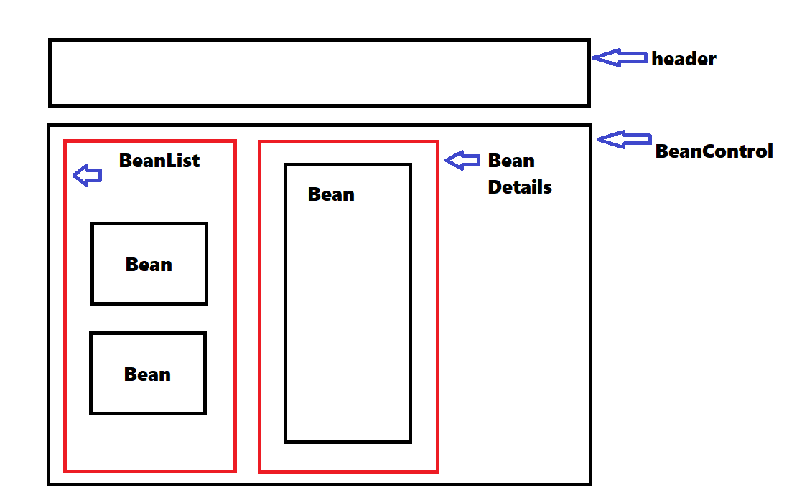

# Avery's "Organics"
#### By Alex Johnson

[Component Diagram](#component-diagram)

[Setup/Installation Guide](#setup/installation-guide)

[Bugs](#known-bugs)

[License](#license)

## Technologies Used

   * javascript
   * react
   * eslint
   * babel
   * webpack
   * jest

## User Stories
* As a user, I want to see a list/menu of all available types of coffee beans.
* For each item, I want to see its name, origin, price, and roast (light, medium, or dark) of the coffee bean. (You are welcome to include anything additional that is relevant to the product your store carries.)
* As a user, I want to submit a form to add a new burlap sack of coffee to the inventory.
* As a user, I want to be able to click on a burlap sack to see its detail page.
* As a user, I want to see how many pounds of coffee beans are left in a burlap sack. A burlap sack has roughly 130 pounds.
* As a user, I want to be able to click a button to sell a pound of coffee beans. This should decrease the number of pounds left by 1. The number of pounds in a sack of coffee beans should not be able to go below 0.

## Component Diagram

### Running the Application

* `npm start`
Runs the app in the development mode.\
Open [http://localhost:3000](http://localhost:3000) to view it in your browser.

The page will reload when you make changes.\
You may also see any lint errors in the console.

* `npm run build`
Runs the application without linting errors or auto reloads

## Known Bugs

## Thanks
 

## License

MIT License

Copyright (c) 2023 Alex Johnson

Permission is hereby granted, free of charge, to any person obtaining a copy of this software and associated documentation files (the "Software"), to deal in the Software without restriction, including without limitation the rights to use, copy, modify, merge, publish, distribute, sublicense, and/or sell copies of the Software, and to permit persons to whom the Software is furnished to do so, subject to the following conditions:

The above copyright notice and this permission notice shall be included in all copies or substantial portions of the Software.

THE SOFTWARE IS PROVIDED "AS IS", WITHOUT WARRANTY OF ANY KIND, EXPRESS OR IMPLIED, INCLUDING BUT NOT LIMITED TO THE WARRANTIES OF MERCHANTABILITY, FITNESS FOR A PARTICULAR PURPOSE AND NONINFRINGEMENT. IN NO EVENT SHALL THE AUTHORS OR COPYRIGHT HOLDERS BE LIABLE FOR ANY CLAIM, DAMAGES OR OTHER LIABILITY, WHETHER IN AN ACTION OF CONTRACT, TORT OR OTHERWISE, ARISING FROM, OUT OF OR IN CONNECTION WITH THE SOFTWARE OR THE USE OR OTHER DEALINGS IN THE SOFTWARE.